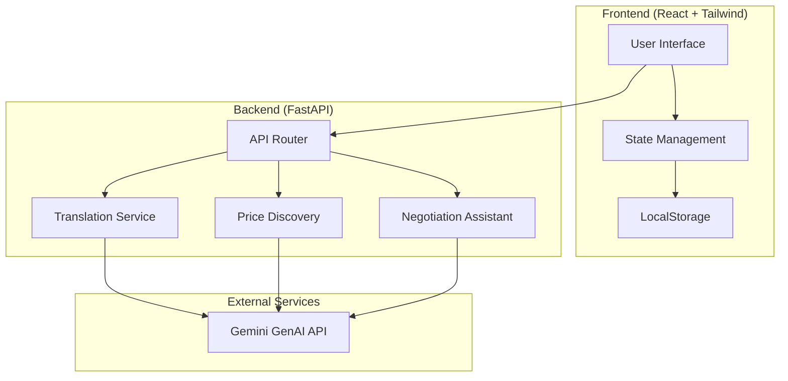

# Design Document: Multilingual Mandi - Vendor Assistant

## Overview

The Multilingual Mandi - Vendor Assistant is a modern web application built with React and Tailwind CSS that enables vendors to manage products, communicate across language barriers, and negotiate effectively with AI assistance. The system prioritizes mobile-first responsive design with an intuitive, visually appealing interface.

## Architecture

### System Architecture



### Technology Stack

- **Frontend**: React 18 with TypeScript, Tailwind CSS for styling
- **Backend**: Python FastAPI with async/await patterns
- **AI Services**: Google Gemini GenAI API for translation and suggestions
- **Storage**: Browser LocalStorage for demo persistence
- **Communication**: REST API with JSON payloads

## Components and Interfaces

### Frontend Components

#### 1. VendorDashboard Component
```typescript
interface VendorDashboardProps {
  products: Product[];
  onAddProduct: (product: ProductInput) => void;
  onDeleteProduct: (id: string) => void;
  onUpdateProduct: (id: string, updates: Partial<Product>) => void;
}
```

**Responsibilities:**
- Display product grid with cards showing name, quantity, price
- Provide "Add Product" floating action button
- Handle product CRUD operations
- Show price suggestion button for each product

#### 2. ProductCard Component
```typescript
interface ProductCardProps {
  product: Product;
  onDelete: () => void;
  onEdit: () => void;
  onPriceSuggest: () => void;
}
```

**Responsibilities:**
- Display product information in card format
- Provide quick action buttons (edit, delete, price suggest)
- Show visual indicators for product status

#### 3. AddProductModal Component
```typescript
interface AddProductModalProps {
  isOpen: boolean;
  onClose: () => void;
  onSubmit: (product: ProductInput) => void;
  suggestedProducts: string[];
}
```

**Responsibilities:**
- Modal form for adding new products
- Dropdown for sample products (Tomato, Onion, Potato, Banana, Apple)
- Input validation and error display
- Price suggestion integration

#### 4. NegotiationChat Component
```typescript
interface NegotiationChatProps {
  chatSession: ChatSession;
  onSendMessage: (message: string) => void;
  onSelectSuggestion: (suggestion: string) => void;
  suggestions: string[];
}
```

**Responsibilities:**
- Real-time chat interface with message bubbles
- Display translated messages with original text toggle
- Show AI reply suggestions as quick action buttons
- Handle message sending and receiving

#### 5. PriceSuggestionModal Component
```typescript
interface PriceSuggestionModalProps {
  product: Product;
  suggestion: PriceSuggestion;
  onAcceptPrice: (price: number) => void;
  onClose: () => void;
}
```

**Responsibilities:**
- Display price range with visual indicators
- Show reasoning for price suggestions
- Allow price acceptance or manual adjustment

### Backend API Endpoints

#### 1. Translation Endpoint
```python
@app.post("/translate")
async def translate_text(request: TranslationRequest) -> TranslationResponse:
    """
    Translates text between languages using Gemini API
    """
```

**Request Schema:**
```typescript
interface TranslationRequest {
  text: string;
  source_language: string;
  target_language: string;
}
```

**Response Schema:**
```typescript
interface TranslationResponse {
  translated_text: string;
  original_text: string;
  source_language: string;
  target_language: string;
  confidence: number;
}
```

#### 2. Price Suggestion Endpoint
```python
@app.post("/price-suggest")
async def suggest_price(request: PriceSuggestionRequest) -> PriceSuggestionResponse:
    """
    Provides AI-powered price suggestions based on product details
    """
```

**Request Schema:**
```typescript
interface PriceSuggestionRequest {
  product_name: string;
  quantity: number;
  current_price?: number;
  location?: string;
}
```

**Response Schema:**
```typescript
interface PriceSuggestionResponse {
  min_price: number;
  max_price: number;
  recommended_price: number;
  reasoning: string;
  market_trend: "rising" | "falling" | "stable";
}
```

#### 3. Negotiation Assistance Endpoint
```python
@app.post("/negotiate")
async def get_negotiation_suggestions(request: NegotiationRequest) -> NegotiationResponse:
    """
    Generates contextual reply suggestions for negotiations
    """
```

**Request Schema:**
```typescript
interface NegotiationRequest {
  product: Product;
  conversation_history: Message[];
  buyer_message: string;
  vendor_language: string;
}
```

**Response Schema:**
```typescript
interface NegotiationResponse {
  suggestions: string[];
  context: string;
  tone: "friendly" | "professional" | "firm";
}
```

## Data Models

### Core Data Types

```typescript
interface Product {
  id: string;
  name: string;
  quantity: number;
  price: number;
  currency: string;
  language: string;
  created_at: string;
  updated_at: string;
}

interface ProductInput {
  name: string;
  quantity: number;
  price: number;
  language: string;
}

interface Message {
  id: string;
  sender: "vendor" | "buyer";
  text: string;
  translated_text?: string;
  language: string;
  timestamp: string;
}

interface ChatSession {
  id: string;
  product_id: string;
  vendor_id: string;
  buyer_id: string;
  messages: Message[];
  status: "active" | "closed";
  created_at: string;
}

interface PriceSuggestion {
  min_price: number;
  max_price: number;
  recommended_price: number;
  reasoning: string;
  market_trend: "rising" | "falling" | "stable";
  confidence: number;
}
```

### LocalStorage Schema

```typescript
interface LocalStorageData {
  products: Product[];
  user_preferences: {
    language: string;
    currency: string;
    location?: string;
  };
  chat_sessions: ChatSession[];
  version: string;
}
```

## UI Design Specifications

### Design System

**Color Palette:**
- Primary: Emerald (green) - `emerald-600`, `emerald-500`, `emerald-400`
- Secondary: Orange - `orange-500`, `orange-400`
- Neutral: Gray scale - `gray-900`, `gray-700`, `gray-500`, `gray-300`, `gray-100`
- Success: Green - `green-500`
- Warning: Yellow - `yellow-500`
- Error: Red - `red-500`

**Typography:**
- Headings: `font-bold` with `text-2xl`, `text-xl`, `text-lg`
- Body: `font-medium` with `text-base`, `text-sm`
- Captions: `font-normal` with `text-xs`

**Spacing:**
- Container padding: `p-4` on mobile, `p-6` on desktop
- Card spacing: `space-y-4` for vertical, `space-x-4` for horizontal
- Button padding: `px-4 py-2` for normal, `px-6 py-3` for large

### Responsive Breakpoints

- **Mobile**: `< 640px` - Single column layout, full-width cards
- **Tablet**: `640px - 1024px` - Two-column grid, larger touch targets
- **Desktop**: `> 1024px` - Three-column grid, hover states

### Component Styling

#### Product Cards
```css
/* Mobile-first card design */
.product-card {
  @apply bg-white rounded-lg shadow-md border border-gray-200 p-4 space-y-3;
  @apply hover:shadow-lg transition-shadow duration-200;
}

.product-card-header {
  @apply flex justify-between items-start;
}

.product-card-actions {
  @apply flex space-x-2 mt-3;
}
```

#### Chat Interface
```css
.chat-container {
  @apply flex flex-col h-screen max-h-96 bg-gray-50 rounded-lg;
}

.message-bubble {
  @apply max-w-xs lg:max-w-md px-4 py-2 rounded-lg;
}

.message-vendor {
  @apply bg-emerald-500 text-white ml-auto;
}

.message-buyer {
  @apply bg-white text-gray-900 mr-auto border;
}
```

#### Buttons and Actions
```css
.btn-primary {
  @apply bg-emerald-600 hover:bg-emerald-700 text-white font-medium py-2 px-4 rounded-lg;
  @apply transition-colors duration-200 focus:ring-2 focus:ring-emerald-500 focus:ring-offset-2;
}

.btn-secondary {
  @apply bg-white hover:bg-gray-50 text-gray-700 font-medium py-2 px-4 rounded-lg border border-gray-300;
  @apply transition-colors duration-200 focus:ring-2 focus:ring-gray-500 focus:ring-offset-2;
}

.floating-action-btn {
  @apply fixed bottom-6 right-6 bg-emerald-600 hover:bg-emerald-700 text-white p-4 rounded-full shadow-lg;
  @apply transition-all duration-200 hover:scale-105 focus:ring-4 focus:ring-emerald-500 focus:ring-opacity-50;
}
```

### Mobile-First Layout

#### Dashboard Layout
```jsx
<div className="min-h-screen bg-gray-50">
  {/* Header */}
  <header className="bg-white shadow-sm border-b border-gray-200 px-4 py-3">
    <h1 className="text-xl font-bold text-gray-900">Mandi Assistant</h1>
  </header>
  
  {/* Main Content */}
  <main className="p-4">
    {/* Product Grid */}
    <div className="grid grid-cols-1 sm:grid-cols-2 lg:grid-cols-3 gap-4">
      {/* Product cards */}
    </div>
  </main>
  
  {/* Floating Add Button */}
  <button className="floating-action-btn">
    <PlusIcon className="w-6 h-6" />
  </button>
</div>
```

## State Management

### React State Structure

```typescript
interface AppState {
  products: Product[];
  currentUser: {
    language: string;
    currency: string;
  };
  ui: {
    isAddProductModalOpen: boolean;
    isPriceSuggestionModalOpen: boolean;
    selectedProduct: Product | null;
    loading: boolean;
    error: string | null;
  };
  chat: {
    activeSessions: ChatSession[];
    currentSession: ChatSession | null;
    suggestions: string[];
  };
}
```

### State Management Patterns

**Local State**: Use `useState` for component-specific state
**Shared State**: Use `useContext` for app-wide state like user preferences
**Async State**: Use custom hooks for API calls with loading/error states

```typescript
// Custom hook for API calls
function useApiCall<T>(apiFunction: () => Promise<T>) {
  const [data, setData] = useState<T | null>(null);
  const [loading, setLoading] = useState(false);
  const [error, setError] = useState<string | null>(null);
  
  const execute = useCallback(async () => {
    setLoading(true);
    setError(null);
    try {
      const result = await apiFunction();
      setData(result);
    } catch (err) {
      setError(err.message);
    } finally {
      setLoading(false);
    }
  }, [apiFunction]);
  
  return { data, loading, error, execute };
}
```

## Correctness Properties

*A property is a characteristic or behavior that should hold true across all valid executions of a system-essentially, a formal statement about what the system should do. Properties serve as the bridge between human-readable specifications and machine-verifiable correctness guarantees.*

### Property 1: Product Creation Validation
*For any* product creation attempt, the system should require all mandatory fields (name, quantity, price, language) and reject incomplete submissions
**Validates: Requirements 1.2**

### Property 2: Product Update Timestamp Preservation
*For any* product update operation, the original creation timestamp should remain unchanged while the modification timestamp should be updated to the current time
**Validates: Requirements 1.3**

### Property 3: Soft Delete Behavior
*For any* product deletion, the product should be removed from active display but its data should be preserved in transaction history
**Validates: Requirements 1.4**

### Property 4: Bidirectional Translation Consistency
*For any* message and language pair, translating from language A to language B and then back to language A should preserve the essential meaning, and both original and translated versions should be stored
**Validates: Requirements 2.1, 2.2, 2.4**

### Property 5: Translation Error Handling
*For any* translation failure, the system should display the original message with a clear error indicator and not block the user interface
**Validates: Requirements 2.3**

### Property 6: Translation Language Indication
*For any* displayed translation, the system should clearly indicate the source and target languages
**Validates: Requirements 2.5**

### Property 7: Price Discovery Completeness
*For any* price discovery request, the system should return a complete price suggestion containing minimum, maximum, and recommended prices along with reasoning
**Validates: Requirements 3.1, 3.2, 3.5**

### Property 8: Price Discovery Fallback
*For any* product when market data is unavailable, the price discovery engine should provide fallback pricing based on product category rather than failing
**Validates: Requirements 3.3**

### Property 9: Price Discovery Input Sensitivity
*For any* two price discovery requests that differ in product type, quantity, or market conditions, the system should produce different price suggestions that reflect these differences
**Validates: Requirements 3.4**

### Property 10: Negotiation Suggestion Generation
*For any* buyer negotiation message, the system should generate exactly three contextual reply suggestions that consider the current offer, product details, and conversation history
**Validates: Requirements 4.1, 4.2**

### Property 11: Negotiation Suggestion Editability
*For any* selected negotiation suggestion, the system should allow the vendor to edit the text before sending
**Validates: Requirements 4.3**

### Property 12: Negotiation Fallback Responses
*For any* situation where contextual suggestions cannot be generated, the system should provide generic professional responses rather than failing
**Validates: Requirements 4.5**

### Property 13: Chat Session Creation
*For any* buyer initiation of contact about a product, the system should create a new chat session with proper initialization
**Validates: Requirements 5.1**

### Property 14: Real-time Message Delivery
*For any* message sent by either party in an active chat session, the message should be delivered to the recipient immediately with proper timestamp and delivery status
**Validates: Requirements 5.2, 5.3**

### Property 15: Message History Persistence
*For any* chat session, all messages should be maintained in history for the duration of the session and preserved during periods of inactivity
**Validates: Requirements 5.4, 5.5**

### Property 16: LocalStorage Data Persistence
*For any* product creation, update, or preference change, the data should be immediately persisted to localStorage and be recoverable after application reload
**Validates: Requirements 6.1, 6.2, 6.3**

### Property 17: Storage Quota Management
*For any* storage operation that would exceed quota limits, the system should handle it gracefully by prioritizing recent data and notifying the user
**Validates: Requirements 6.4, 6.5**

### Property 18: Language Detection and Switching
*For any* user accessing the application, the system should detect browser language preferences initially and allow immediate UI updates when language is changed
**Validates: Requirements 7.1, 7.2**

### Property 19: Language Fallback Behavior
*For any* situation where language resources are unavailable, the system should fall back to English interface while maintaining separate settings for interface and communication languages
**Validates: Requirements 7.4, 7.5**

### Property 20: Responsive Interface Adaptation
*For any* screen size change or mobile device access, the system should adapt the interface appropriately for touch interaction and maintain usability
**Validates: Requirements 8.1, 8.2, 8.4**

### Property 21: API Error Response Consistency
*For any* API request failure or malformed input, the system should return appropriate HTTP status codes with descriptive error messages
**Validates: Requirements 9.4, 9.5**

### Property 22: Network Resilience
*For any* network connectivity loss, the system should queue messages for delivery when connection is restored and provide clear status indicators
**Validates: Requirements 10.1**

### Property 23: Service Fallback Reliability
*For any* AI service unavailability, the system should provide fallback functionality with clear status indicators rather than complete failure
**Validates: Requirements 10.2**

### Property 24: Error Recovery and Data Preservation
*For any* critical error or storage operation failure, the system should preserve user data, attempt retry with exponential backoff, and provide recovery options
**Validates: Requirements 10.3, 10.5**

### Property 25: User-Friendly Error Communication
*For any* error condition, the system should display user-friendly error messages that explain the issue and suggest actionable solutions
**Validates: Requirements 10.4**

Now I need to use the prework tool to analyze the acceptance criteria before writing the Correctness Properties section.

## Error Handling

### Error Categories and Strategies

#### 1. Network and API Errors
**Strategy**: Graceful degradation with retry mechanisms
- **Translation API failures**: Display original text with error indicator, allow manual retry
- **Price suggestion failures**: Show cached suggestions or category-based fallbacks
- **Network connectivity loss**: Queue operations for retry when connection restored

#### 2. Data Validation Errors
**Strategy**: Immediate feedback with clear guidance
- **Product creation validation**: Highlight missing fields with specific error messages
- **API input validation**: Return descriptive error messages with correction suggestions
- **File format errors**: Provide examples of correct format

#### 3. Storage and Persistence Errors
**Strategy**: Data preservation with user notification
- **LocalStorage quota exceeded**: Prioritize recent data, notify user of cleanup
- **Storage operation failures**: Implement exponential backoff retry, preserve data in memory
- **Data corruption**: Attempt recovery, provide export/import options

#### 4. AI Service Errors
**Strategy**: Fallback functionality with status transparency
- **Translation service unavailable**: Allow manual language selection, show service status
- **Price discovery failures**: Use category-based pricing, historical data
- **Negotiation assistant errors**: Provide generic professional responses

### Error Recovery Mechanisms

```typescript
interface ErrorRecovery {
  retryWithBackoff: (operation: () => Promise<any>, maxRetries: number) => Promise<any>;
  fallbackToCache: (key: string, fallbackValue: any) => any;
  preserveUserData: (data: any) => void;
  notifyUser: (error: Error, recovery: string) => void;
}
```

## Testing Strategy

### Dual Testing Approach

The system requires both unit testing and property-based testing for comprehensive coverage:

**Unit Tests**: Focus on specific examples, edge cases, and integration points
**Property Tests**: Verify universal properties across all possible inputs

### Unit Testing Strategy

**Framework**: Jest with React Testing Library for frontend, pytest for backend
**Coverage Areas**:
- Component rendering and user interactions
- API endpoint responses with specific inputs
- Error boundary behavior
- Integration between components
- Edge cases like empty data, network failures, storage limits

**Example Unit Tests**:
```typescript
// Test specific product creation scenario
test('should create product with valid data', () => {
  const product = { name: 'Tomato', quantity: 10, price: 40, language: 'hi' };
  const result = createProduct(product);
  expect(result.success).toBe(true);
  expect(result.product.id).toBeDefined();
});

// Test specific error condition
test('should handle translation API failure gracefully', async () => {
  mockTranslationAPI.mockRejectedValue(new Error('Service unavailable'));
  const result = await translateMessage('Hello', 'en', 'hi');
  expect(result.error).toBe(true);
  expect(result.originalText).toBe('Hello');
});
```

### Property-Based Testing Strategy

**Framework**: fast-check for TypeScript/JavaScript, Hypothesis for Python
**Configuration**: Minimum 100 iterations per property test
**Tag Format**: Each test tagged with `Feature: multilingual-mandi-vendor-assistant, Property {number}: {property_text}`

**Property Test Categories**:

1. **Data Integrity Properties**: Test that operations preserve data consistency
2. **Translation Properties**: Verify bidirectional translation behavior
3. **API Contract Properties**: Ensure API responses match expected schemas
4. **Storage Properties**: Test persistence and recovery across all data types
5. **Error Handling Properties**: Verify graceful failure across all error conditions

**Example Property Tests**:
```typescript
// Property 1: Product Creation Validation
test('Property 1: Product creation validation', () => {
  fc.assert(fc.property(
    fc.record({
      name: fc.string(),
      quantity: fc.integer(),
      price: fc.float(),
      language: fc.string()
    }),
    (productData) => {
      const result = validateProductData(productData);
      // Should require all mandatory fields
      const hasAllRequired = productData.name && 
                           productData.quantity >= 0 && 
                           productData.price > 0 && 
                           productData.language;
      expect(result.valid).toBe(hasAllRequired);
    }
  ));
});

// Property 16: LocalStorage Data Persistence  
test('Property 16: LocalStorage data persistence', () => {
  fc.assert(fc.property(
    fc.array(fc.record({
      name: fc.string(1, 50),
      quantity: fc.integer(0, 1000),
      price: fc.float(0.01, 10000),
      language: fc.constantFrom('en', 'hi', 'ta', 'te')
    })),
    (products) => {
      // Save products to localStorage
      saveProductsToStorage(products);
      
      // Simulate app reload
      clearMemoryState();
      
      // Restore from localStorage
      const restored = loadProductsFromStorage();
      
      // Should restore all products with same data
      expect(restored).toEqual(products);
    }
  ));
});
```

### Integration Testing

**Scope**: End-to-end workflows combining multiple components
**Tools**: Playwright for browser automation, API testing with actual backend

**Key Integration Scenarios**:
- Complete product creation → price discovery → negotiation flow
- Multi-language communication with real translation API
- Offline/online state transitions with message queuing
- Cross-browser compatibility and mobile responsiveness

### Performance Testing

**Metrics**: Load times, API response times, memory usage
**Tools**: Lighthouse for frontend performance, load testing for APIs
**Targets**: 
- Initial page load < 2 seconds on 3G
- API responses < 500ms for 95th percentile
- Memory usage stable during extended sessions

### Test Data Management

**Strategy**: Use realistic test data that reflects actual usage patterns
**Data Sources**:
- Sample Indian market products and prices
- Common negotiation phrases in multiple languages
- Realistic user interaction patterns

**Test Data Generation**:
```typescript
const generateTestProduct = () => ({
  name: fc.sample(fc.constantFrom('Tomato', 'Onion', 'Potato', 'Banana', 'Apple'), 1)[0],
  quantity: fc.sample(fc.integer(1, 100), 1)[0],
  price: fc.sample(fc.float(10, 200), 1)[0],
  language: fc.sample(fc.constantFrom('en', 'hi', 'ta', 'te', 'bn'), 1)[0]
});
```

This comprehensive testing strategy ensures both specific functionality works correctly (unit tests) and universal properties hold across all inputs (property tests), providing confidence in system correctness and reliability.