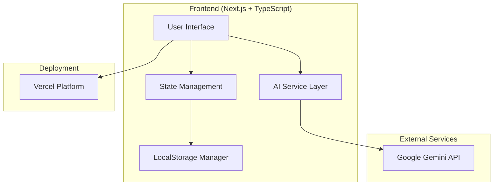

# Design Document: Multilingual Mandi - Vendor Assistant (Frontend-Only)

## Overview

The Multilingual Mandi - Vendor Assistant is a modern frontend-only web application built with Next.js, TypeScript, and Tailwind CSS. It enables vendors to manage products, communicate across language barriers, and negotiate effectively with direct Gemini AI integration. The system uses LocalStorage for data persistence and prioritizes mobile-first responsive design with an intuitive, visually appealing interface.

## Architecture

### System Architecture



### Technology Stack

- **Frontend**: Next.js 16.1.1 with TypeScript, Tailwind CSS 3.4.17
- **AI Services**: Google Gemini API via @google/genai package
- **Storage**: Browser LocalStorage for client-side persistence
- **Deployment**: Vercel static/serverless hosting
- **Communication**: Direct API calls to Gemini with client-side state management

## Components and Interfaces

### Frontend Components

#### 1. VendorDashboard Component
```typescript
interface VendorDashboardProps {
  products: Product[];
  onAddProduct: (product: ProductInput) => void;
  onDeleteProduct: (id: string) => void;
  onUpdateProduct: (id: string, updates: Partial<Product>) => void;
}
```

**Responsibilities:**
- Display product grid with cards showing name, quantity, price
- Provide "Add Product" floating action button
- Handle product CRUD operations with LocalStorage
- Show price suggestion button for each product

#### 2. ProductCard Component
```typescript
interface ProductCardProps {
  product: Product;
  onDelete: () => void;
  onEdit: () => void;
  onPriceSuggest: () => void;
}
```

**Responsibilities:**
- Display product information in card format
- Provide quick action buttons (edit, delete, price suggest)
- Show visual indicators for product status
- Mobile-optimized touch interactions

#### 3. AddProductModal Component
```typescript
interface AddProductModalProps {
  isOpen: boolean;
  onClose: () => void;
  onSubmit: (product: ProductInput) => void;
  suggestedProducts: string[];
}
```

**Responsibilities:**
- Modal form for adding new products
- Dropdown for sample products (Tomato, Onion, Potato, Banana, Apple)
- Input validation and error display
- Integration with LocalStorage persistence

#### 4. NegotiationChat Component
```typescript
interface NegotiationChatProps {
  chatSession: ChatSession;
  onSendMessage: (message: string) => void;
  onSelectSuggestion: (suggestion: string) => void;
  suggestions: string[];
}
```

**Responsibilities:**
- Real-time chat interface with message bubbles
- Display translated messages with original text toggle
- Show AI reply suggestions as quick action buttons
- Store chat history in LocalStorage

#### 5. PriceSuggestionModal Component
```typescript
interface PriceSuggestionModalProps {
  product: Product;
  suggestion: PriceSuggestion;
  onAcceptPrice: (price: number) => void;
  onClose: () => void;
}
```

**Responsibilities:**
- Display price range with visual indicators
- Show AI reasoning for price suggestions
- Allow price acceptance or manual adjustment
- Handle Gemini API integration for pricing

### AI Service Layer

#### 1. Gemini Translation Service
```typescript
interface TranslationService {
  translateText(text: string, sourceLang: string, targetLang: string): Promise<TranslationResponse>;
  detectLanguage(text: string): Promise<string>;
  getCachedTranslation(text: string, sourceLang: string, targetLang: string): TranslationResponse | null;
}
```

#### 2. Gemini Price Discovery Service
```typescript
interface PriceDiscoveryService {
  suggestPrice(product: ProductInput, context?: MarketContext): Promise<PriceSuggestionResponse>;
  getMarketTrend(productName: string): Promise<MarketTrend>;
  getFallbackPrice(productCategory: string): PriceSuggestionResponse;
}
```

#### 3. Gemini Negotiation Assistant
```typescript
interface NegotiationService {
  generateSuggestions(context: NegotiationContext): Promise<string[]>;
  analyzeMessage(message: string): Promise<MessageAnalysis>;
  getFallbackResponses(): string[];
}
```

## Data Models

### Core Data Types

```typescript
interface Product {
  id: string;
  name: string;
  quantity: number;
  price: number;
  currency: string;
  language: string;
  created_at: string;
  updated_at: string;
}

interface ProductInput {
  name: string;
  quantity: number;
  price: number;
  language: string;
}

interface Message {
  id: string;
  sender: "vendor" | "buyer";
  text: string;
  translated_text?: string;
  language: string;
  timestamp: string;
}

interface ChatSession {
  id: string;
  product_id: string;
  vendor_id: string;
  buyer_id: string;
  messages: Message[];
  status: "active" | "closed";
  created_at: string;
}

interface PriceSuggestion {
  min_price: number;
  max_price: number;
  recommended_price: number;
  reasoning: string;
  market_trend: "rising" | "falling" | "stable";
  confidence: number;
}

interface TranslationResponse {
  translated_text: string;
  original_text: string;
  source_language: string;
  target_language: string;
  confidence: number;
}
```

### LocalStorage Schema

```typescript
interface LocalStorageData {
  products: Product[];
  user_preferences: {
    language: string;
    currency: string;
    location?: string;
  };
  chat_sessions: ChatSession[];
  translation_cache: Record<string, TranslationResponse>;
  version: string;
}
```

## AI Integration Architecture

### Gemini API Integration

```typescript
// AI Service Configuration
interface GeminiConfig {
  apiKey: string;
  model: string;
  temperature: number;
  maxTokens: number;
}

// Service Implementation
class GeminiAIService {
  private client: GoogleGenerativeAI;
  
  constructor(config: GeminiConfig) {
    this.client = new GoogleGenerativeAI(config.apiKey);
  }
  
  async translateText(text: string, targetLang: string): Promise<TranslationResponse> {
    const model = this.client.getGenerativeModel({ model: "gemini-pro" });
    const prompt = `Translate the following text to ${targetLang}: "${text}"`;
    
    try {
      const result = await model.generateContent(prompt);
      return {
        translated_text: result.response.text(),
        original_text: text,
        source_language: "auto-detect",
        target_language: targetLang,
        confidence: 0.95
      };
    } catch (error) {
      throw new Error(`Translation failed: ${error.message}`);
    }
  }
  
  async suggestPrice(product: ProductInput): Promise<PriceSuggestion> {
    const model = this.client.getGenerativeModel({ model: "gemini-pro" });
    const prompt = `Suggest a fair market price for ${product.quantity}kg of ${product.name} in Indian markets. Current asking price is ₹${product.price}. Provide min, max, and recommended prices with reasoning.`;
    
    try {
      const result = await model.generateContent(prompt);
      // Parse AI response and return structured data
      return this.parsePriceSuggestion(result.response.text(), product);
    } catch (error) {
      return this.getFallbackPrice(product);
    }
  }
}
```

### Error Handling and Fallbacks

```typescript
interface AIServiceWithFallback {
  primary: GeminiAIService;
  fallback: FallbackService;
  cache: CacheService;
  
  async executeWithFallback<T>(
    operation: () => Promise<T>,
    fallbackOperation: () => T
  ): Promise<T> {
    try {
      return await operation();
    } catch (error) {
      console.warn('AI service failed, using fallback:', error);
      return fallbackOperation();
    }
  }
}
```

## UI Design Specifications

### Design System

**Color Palette:**
- Primary: Emerald (green) - `emerald-600`, `emerald-500`, `emerald-400`
- Secondary: Orange - `orange-500`, `orange-400`
- Neutral: Gray scale - `gray-900`, `gray-700`, `gray-500`, `gray-300`, `gray-100`
- Success: Green - `green-500`
- Warning: Yellow - `yellow-500`
- Error: Red - `red-500`

**Typography:**
- Headings: `font-bold` with `text-2xl`, `text-xl`, `text-lg`
- Body: `font-medium` with `text-base`, `text-sm`
- Captions: `font-normal` with `text-xs`

**Spacing:**
- Container padding: `p-4` on mobile, `p-6` on desktop
- Card spacing: `space-y-4` for vertical, `space-x-4` for horizontal
- Button padding: `px-4 py-2` for normal, `px-6 py-3` for large

### Responsive Breakpoints

- **Mobile**: `< 640px` - Single column layout, full-width cards
- **Tablet**: `640px - 1024px` - Two-column grid, larger touch targets
- **Desktop**: `> 1024px` - Three-column grid, hover states

### Component Styling

#### Product Cards
```css
/* Mobile-first card design */
.product-card {
  @apply bg-white rounded-2xl shadow-lg border border-gray-100 p-6 space-y-4;
  @apply hover:shadow-2xl hover:-translate-y-2 transition-all duration-300;
}

.product-card-header {
  @apply flex justify-between items-start;
}

.product-card-actions {
  @apply flex space-x-3 mt-4;
}
```

#### Chat Interface
```css
.chat-container {
  @apply flex flex-col h-screen max-h-96 bg-gray-50 rounded-2xl;
}

.message-bubble {
  @apply max-w-xs lg:max-w-md px-4 py-3 rounded-xl;
}

.message-vendor {
  @apply bg-emerald-500 text-white ml-auto;
}

.message-buyer {
  @apply bg-white text-gray-900 mr-auto border border-gray-200;
}
```

#### Buttons and Actions
```css
.btn-primary {
  @apply bg-gradient-to-r from-emerald-500 to-emerald-600 hover:from-emerald-600 hover:to-emerald-700;
  @apply text-white font-semibold py-3 px-6 rounded-xl shadow-lg hover:shadow-xl;
  @apply transition-all duration-200 transform hover:-translate-y-1;
}

.btn-secondary {
  @apply bg-white hover:bg-gray-50 text-gray-700 font-medium py-3 px-6 rounded-xl;
  @apply border-2 border-gray-200 hover:border-emerald-300 transition-all duration-200;
}

.floating-action-btn {
  @apply fixed bottom-6 right-6 bg-gradient-to-r from-emerald-500 to-emerald-600;
  @apply text-white p-4 rounded-full shadow-2xl hover:shadow-3xl;
  @apply transition-all duration-300 hover:scale-110 z-40;
}
```

## State Management

### React State Structure

```typescript
interface AppState {
  products: Product[];
  currentUser: {
    language: string;
    currency: string;
  };
  ui: {
    isAddProductModalOpen: boolean;
    isPriceSuggestionModalOpen: boolean;
    selectedProduct: Product | null;
    loading: boolean;
    error: string | null;
  };
  chat: {
    activeSessions: ChatSession[];
    currentSession: ChatSession | null;
    suggestions: string[];
  };
  ai: {
    translationCache: Map<string, TranslationResponse>;
    priceCache: Map<string, PriceSuggestion>;
    isOnline: boolean;
  };
}
```

### Custom Hooks for AI Integration

```typescript
// Hook for Gemini AI operations
function useGeminiAI() {
  const [loading, setLoading] = useState(false);
  const [error, setError] = useState<string | null>(null);
  
  const translateText = useCallback(async (text: string, targetLang: string) => {
    setLoading(true);
    setError(null);
    try {
      const result = await geminiService.translateText(text, targetLang);
      return result;
    } catch (err) {
      setError(err.message);
      return null;
    } finally {
      setLoading(false);
    }
  }, []);
  
  const suggestPrice = useCallback(async (product: ProductInput) => {
    setLoading(true);
    setError(null);
    try {
      const result = await geminiService.suggestPrice(product);
      return result;
    } catch (err) {
      setError(err.message);
      return getFallbackPrice(product);
    } finally {
      setLoading(false);
    }
  }, []);
  
  return { translateText, suggestPrice, loading, error };
}

// Hook for LocalStorage operations
function useLocalStorage<T>(key: string, initialValue: T) {
  const [storedValue, setStoredValue] = useState<T>(() => {
    try {
      const item = window.localStorage.getItem(key);
      return item ? JSON.parse(item) : initialValue;
    } catch (error) {
      console.error(`Error reading localStorage key "${key}":`, error);
      return initialValue;
    }
  });
  
  const setValue = useCallback((value: T | ((val: T) => T)) => {
    try {
      const valueToStore = value instanceof Function ? value(storedValue) : value;
      setStoredValue(valueToStore);
      window.localStorage.setItem(key, JSON.stringify(valueToStore));
    } catch (error) {
      console.error(`Error setting localStorage key "${key}":`, error);
    }
  }, [key, storedValue]);
  
  return [storedValue, setValue] as const;
}
```

## Deployment Configuration

### Vercel Configuration

```json
// vercel.json
{
  "framework": "nextjs",
  "buildCommand": "npm run build",
  "outputDirectory": ".next",
  "installCommand": "npm install",
  "env": {
    "NEXT_PUBLIC_GEMINI_API_KEY": "@gemini-api-key"
  },
  "functions": {
    "pages/api/**/*.js": {
      "runtime": "nodejs18.x"
    }
  }
}
```

### Environment Variables

```bash
# .env.local (development)
NEXT_PUBLIC_GEMINI_API_KEY=your_gemini_api_key_here
NEXT_PUBLIC_APP_ENV=development

# .env.production (Vercel)
NEXT_PUBLIC_GEMINI_API_KEY=production_gemini_api_key
NEXT_PUBLIC_APP_ENV=production
```

### Build Optimization

```javascript
// next.config.js
/** @type {import('next').NextConfig} */
const nextConfig = {
  reactStrictMode: true,
  swcMinify: true,
  compiler: {
    removeConsole: process.env.NODE_ENV === 'production',
  },
  experimental: {
    optimizeCss: true,
  },
  env: {
    CUSTOM_KEY: process.env.CUSTOM_KEY,
  },
}

module.exports = nextConfig
```

## Correctness Properties

*A property is a characteristic or behavior that should hold true across all valid executions of a system-essentially, a formal statement about what the system should do. Properties serve as the bridge between human-readable specifications and machine-verifiable correctness guarantees.*

### Property 1: Product Creation Validation
*For any* product creation attempt, the system should require all mandatory fields (name, quantity, price, language) and reject incomplete submissions
**Validates: Requirements 1.2**

### Property 2: Product Update Timestamp Preservation
*For any* product update operation, the original creation timestamp should remain unchanged while the modification timestamp should be updated to the current time
**Validates: Requirements 1.3**

### Property 3: Soft Delete Behavior
*For any* product deletion, the product should be removed from active display but its data should be preserved in transaction history
**Validates: Requirements 1.4**

### Property 4: Bidirectional Translation Consistency
*For any* message and language pair, translating from language A to language B and then back to language A should preserve the essential meaning, and both original and translated versions should be stored
**Validates: Requirements 2.1, 2.2, 2.4**

### Property 5: Translation Error Handling
*For any* translation failure, the system should display the original message with a clear error indicator and not block the user interface
**Validates: Requirements 2.3**

### Property 6: Translation Language Indication
*For any* displayed translation, the system should clearly indicate the source and target languages
**Validates: Requirements 2.5**

### Property 7: Price Discovery Completeness
*For any* price discovery request, the system should return a complete price suggestion containing minimum, maximum, and recommended prices along with reasoning
**Validates: Requirements 3.1, 3.2, 3.5**

### Property 8: Price Discovery Fallback
*For any* product when market data is unavailable, the price discovery engine should provide fallback pricing based on product category rather than failing
**Validates: Requirements 3.3**

### Property 9: Price Discovery Input Sensitivity
*For any* two price discovery requests that differ in product type, quantity, or market conditions, the system should produce different price suggestions that reflect these differences
**Validates: Requirements 3.4**

### Property 10: Negotiation Suggestion Generation
*For any* buyer negotiation message, the system should generate exactly three contextual reply suggestions that consider the current offer, product details, and conversation history
**Validates: Requirements 4.1, 4.2**

### Property 11: Negotiation Suggestion Editability
*For any* selected negotiation suggestion, the system should allow the vendor to edit the text before sending
**Validates: Requirements 4.3**

### Property 12: Negotiation Fallback Responses
*For any* situation where contextual suggestions cannot be generated, the system should provide generic professional responses rather than failing
**Validates: Requirements 4.5**

### Property 13: Chat Session Creation
*For any* buyer initiation of contact about a product, the system should create a new chat session with proper initialization in LocalStorage
**Validates: Requirements 5.1**

### Property 14: Message Storage and Display
*For any* message sent by either party in an active chat session, the message should be stored in LocalStorage immediately and displayed with proper timestamp
**Validates: Requirements 5.2, 5.3**

### Property 15: Message History Persistence
*For any* chat session, all messages should be maintained in LocalStorage and be recoverable after application reload
**Validates: Requirements 5.4, 5.5**

### Property 16: LocalStorage Data Persistence
*For any* product creation, update, or preference change, the data should be immediately persisted to localStorage and be recoverable after application reload
**Validates: Requirements 6.1, 6.2, 6.3**

### Property 17: Storage Quota Management
*For any* storage operation that would exceed quota limits, the system should handle it gracefully by prioritizing recent data and notifying the user
**Validates: Requirements 6.4, 6.5**

### Property 18: Language Detection and Switching
*For any* user accessing the application, the system should detect browser language preferences initially and allow immediate UI updates when language is changed
**Validates: Requirements 7.1, 7.2**

### Property 19: Language Fallback Behavior
*For any* situation where language resources are unavailable, the system should fall back to English interface while maintaining separate settings for interface and communication languages
**Validates: Requirements 7.4, 7.5**

### Property 20: Responsive Interface Adaptation
*For any* screen size change or mobile device access, the system should adapt the interface appropriately for touch interaction and maintain usability
**Validates: Requirements 8.1, 8.2, 8.4**

### Property 21: Gemini API Error Response Handling
*For any* Gemini API request failure or malformed input, the system should handle errors gracefully with appropriate fallback responses
**Validates: Requirements 9.4, 9.5**

### Property 22: Network Resilience
*For any* network connectivity loss, the system should queue operations in LocalStorage for processing when connection is restored and provide clear status indicators
**Validates: Requirements 10.1**

### Property 23: Service Fallback Reliability
*For any* Gemini AI service unavailability, the system should provide fallback functionality with clear status indicators rather than complete failure
**Validates: Requirements 10.2**

### Property 24: Error Recovery and Data Preservation
*For any* critical error or storage operation failure, the system should preserve user data in LocalStorage, attempt retry with exponential backoff, and provide recovery options
**Validates: Requirements 10.3, 10.5**

### Property 25: User-Friendly Error Communication
*For any* error condition, the system should display user-friendly error messages that explain the issue and suggest actionable solutions
**Validates: Requirements 10.4**

## Error Handling

### Error Categories and Strategies

#### 1. Gemini API Errors
**Strategy**: Graceful degradation with cached responses
- **Translation API failures**: Use cached translations or display original text with error indicator
- **Price suggestion failures**: Show cached suggestions or category-based fallbacks
- **Rate limiting**: Implement exponential backoff and queue requests

#### 2. Data Validation Errors
**Strategy**: Immediate feedback with clear guidance
- **Product creation validation**: Highlight missing fields with specific error messages
- **Input validation**: Provide real-time validation with correction suggestions
- **File format errors**: Provide examples of correct format

#### 3. LocalStorage Errors
**Strategy**: Data preservation with user notification
- **Storage quota exceeded**: Prioritize recent data, notify user of cleanup options
- **Storage operation failures**: Implement retry mechanisms, preserve data in memory
- **Data corruption**: Attempt recovery, provide export/import options

#### 4. Network and Connectivity Errors
**Strategy**: Offline-first approach with sync when online
- **Network unavailable**: Queue operations for later sync, show offline indicator
- **Slow connections**: Implement timeout handling, show loading states
- **Intermittent connectivity**: Retry with exponential backoff

### Testing Strategy

The system requires comprehensive testing for a frontend-only architecture:

**Unit Tests**: Focus on component behavior, LocalStorage operations, and AI service integration
**Integration Tests**: Test complete user workflows with mocked Gemini API responses
**Property Tests**: Verify universal properties across all possible inputs (minimum 100 iterations)

**Framework**: Jest with React Testing Library for components, fast-check for property testing

This design ensures a robust, scalable, and maintainable frontend-only solution that can be rapidly deployed to Vercel while providing full AI-powered functionality through direct Gemini integration.